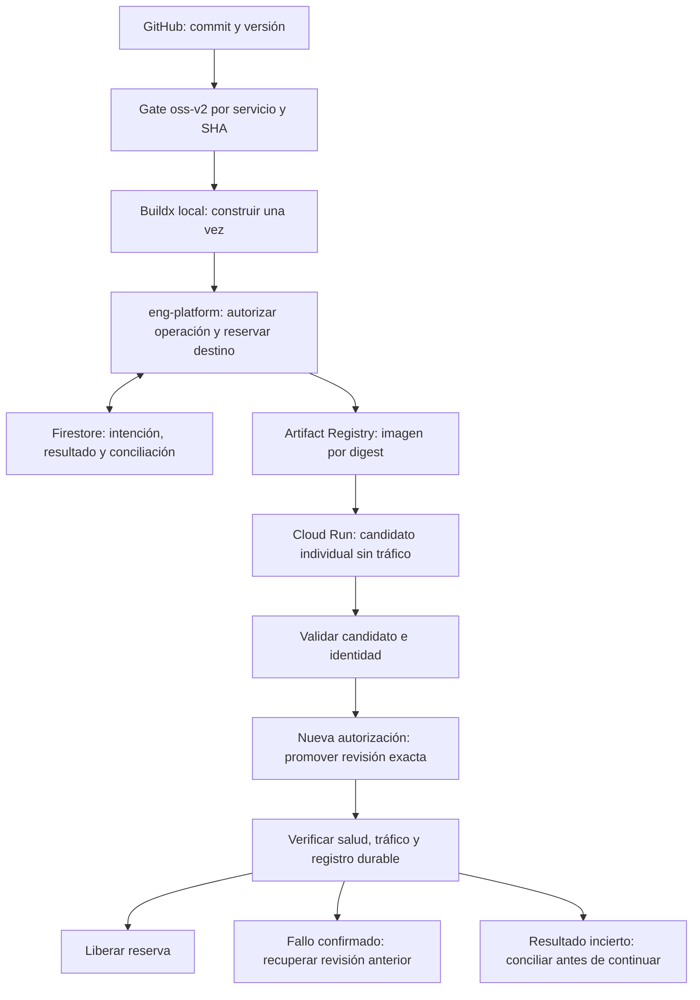

# Releases individuales: control remoto, ejecución local

## Estado de esta implementación

El comando conjunto `sanplat` y su adaptador ejecutable fueron retirados.
API y Web usan el mismo ciclo individual que eng-platform, con manifiesto,
identidad e historial propios. Los registros históricos de agrupación se
conservan: una ejecución conjunta antigua requiere revisión manual y nunca se
convierte ni se reanuda automáticamente.

El código incorpora controles productivos, pero **su presencia no acredita un
despliegue**. El gate del commit final, Firestore Emulator, candidato real,
promoción y comprobación productiva deben constar en la evidencia de entrega.
Las cifras históricas no validan cambios posteriores.

## Responsabilidades

| Componente | Responsabilidad |
|---|---|
| GitHub | Código, commit revisado, versiones y checks protegidos |
| eng-platform | Identidad OAuth, autorización por operación, adopción, reserva, intención y resultado |
| Motor local | Calidad, Docker Buildx y ejecución de efectos autorizados |
| Firestore | Autorizaciones consumidas y control compartido entre procesos/hosts |
| Artifact Registry | Imagen identificada por digest |
| Cloud Run | Candidato sin tráfico y revisión que sirve producción |

Cloud Build no participa en este flujo. No se retira globalmente ni se cambian
sus permisos. El arranque de la plataforma usa el release vigente, con sus
gates y autorizaciones; no depende de capacidades aún no desplegadas.

Este ciclo se ejecuta separadamente para API, Web o cualquier servicio adoptado.
No pausa colas, planificadores, dependencias ni otros servicios.

## Activación y credenciales

El servidor exige `ENG_PLATFORM_LOCAL_RELEASE_ENABLED=true` y que el servicio
esté incluido en `ENG_PLATFORM_LOCAL_RELEASE_SERVICES` (lista separada por comas).
Ambos están deshabilitados/vacíos por defecto. En producción requiere además:

- `ENG_PLATFORM_GCP_PROJECT_ID`.
- `ENG_PLATFORM_RELEASE_CONTROL_FIRESTORE_COLLECTION`.
- `ENG_PLATFORM_RELEASE_AUTH_FIRESTORE_COLLECTION`.
- Clave de firma de autorizaciones y lista de operadores permitidos.
- Ausencia de despliegues anteriores pendientes para el servicio.

Los servicios adoptados no aceptan nuevos dispatches, reintentos ni consumo de
tickets Actions desde la plataforma, incluso si la ejecución local se apaga
temporalmente. La adopción no cancela un workflow ya despachado: antes de
activarla hay que comprobar su terminación. No se modifican branch protections
ni se omiten gates.

Antes de publicar tags localmente se deshabilita **solo** el workflow
`semantic-release.yml` del repositorio adoptado y se espera a que terminen sus
ejecuciones pendientes. El servidor verifica ese traspaso en GitHub antes de
autorizar publicación y antes de cada intención; si GitHub no permite verificarlo,
falla cerrado. CI y los checks protegidos permanecen activos. El bootstrap ocurre
antes de este traspaso, mediante el publicador vigente.

El CLI usa `ENG_PLATFORM_API_URL` y `ENG_PLATFORM_AUTH_HEADERS_FILE`, archivo
privado del usuario (sin permisos para grupo/otros) que contiene únicamente
cabeceras de su sesión autorizada. No pasar cookies o tokens como argumentos,
ni incluirlos en manifiestos, diarios, reportes o Git. El cliente obtiene el
actor desde la sesión; solicita la capacidad a eng-platform y la mantiene en
memoria. Las peticiones con credenciales no siguen redirecciones.

La bandera del CLI no salta controles del servidor. Los adaptadores inyectados
y transportes sintéticos son para pruebas locales; no acreditan acceso real.

## Ciclo

Los comandos `publish`, `candidate`, `register`, `promote` y `rollback`
generan planes sin efectos por defecto. Para ejecutar requieren `--execute`
y `--confirm-remote-effects`; promoción y recuperación requieren además
`--confirm PROMOTE_PROD` o `--confirm ROLLBACK_PROD`.

1. Fijar catálogo, repositorio, commit limpio, versión y configuración.
2. Ejecutar calidad canónica `oss-v2`, global según catálogo y diferencial 80%.
3. Construir una vez con Buildx para `linux/amd64`; conservar digest verificable.
4. Publicar imagen y versión bajo autorización y reserva de publicación.
5. Crear candidato individual por digest, sin tráfico, bajo reserva de destino.
6. Validar identidad y salud; registrar con su intención durable exacta.
7. Autorizar y promover esa revisión, sin reconstrucción.
8. Verificar tráfico, salud e historial y liberar la reserva.

La reserva de destino usa proyecto/región/servicio. Dos destinos distintos
pueden avanzar simultáneamente. La publicación usa repositorio/política de
versionado para evitar colisiones de tags.

`rollback --target-revision <revision>` exige una revisión conocida y verificada.
Solo cambia tráfico: no reconstruye ni revierte datos o migraciones.
El registro local exige sesión, intención vigente y payload exacto; el servidor
rechaza cambios de actor, release, SHA, digest, revisión o fase no autorizados.

## Fallos y reanudación

Cada efecto requiere autorización consumida, reserva vigente e intención
durable antes de ejecutarse. Un intent existente nunca concede otra ejecución.
Si se pierde una respuesta, se conserva `UNKNOWN`; no se repite el efecto ni se
toma el bloqueo por vencimiento como prueba de que no ocurrió.

`resume --release-id <id> --reconcile` consulta observaciones y el control
durable. No despliega, no promueve y no reconstruye automáticamente.
`reconcile-build` inspecciona una construcción local incierta sin repetirla.

## Validación y arranque productivo

`scripts/release/firestore-control-integration` inicia el emulador oficial y
dos API locales con proyecto, colecciones y credenciales sintéticos. Exige un
snapshot limpio y registra el SHA. No sustituye Firestore por JSON ni valida
producción. Requiere gcloud, Firestore Emulator y Java 21 o superior.

Antes del despliegue:

1. Completar suite, gate del SHA final y emulador; revisar independientemente.
2. Confirmar revisión/digest/configuración productivos y recuperación.
3. Desplegar control compatible mediante el flujo vigente con motor apagado.
4. Validar autenticación, autorización y persistencia reales con candidato.
5. Adoptar solo eng-platform-api y completar el release individual real.
6. Registrar commit, versión del motor, digest, revisión, salud, intención,
   resultado y reserva liberada. Conciliar cualquier resultado incierto.

No declarar terminado por pasar fixtures o activar una bandera. Si falta una
sesión autorizada o una autorización excepcional, detener el tramo productivo
y solicitarla; nunca usar un procedimiento de emergencia automáticamente.
